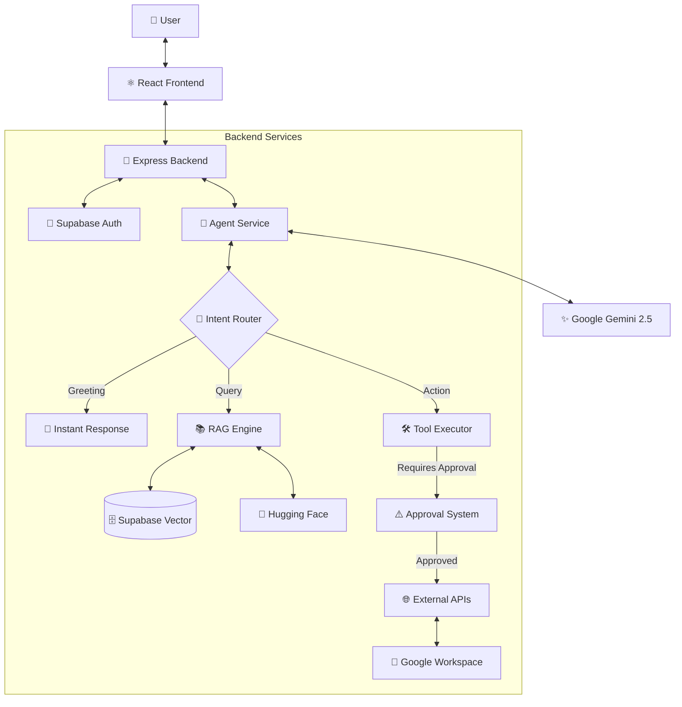

# 🤖 NovaTech AI Onboarding Assistant

<div align="center">


**An enterprise-grade Agentic AI chatbot designed to streamline employee onboarding.**  
*Powered by Google Gemini 2.5 Flash, RAG, and Autonomous Tool Use.*

[Features](#-features) • [Architecture](#-architecture) • [Quick Start](#-quick-start) • [Tech Stack](#-technology-stack)

</div>

---

## ✨ Features

### 🧠 Advanced Agentic AI ("Nova")
- **Multi-Step Workflows:** Capable of executing complex tasks like *"Check my calendar for next week and book a meeting with John."*
- **Date/Time Awareness:** The agent knows the current date and can understand relative dates:
  - *"Book vacation for tomorrow"* → Automatically calculates the correct date
  - *"Take 3 days off starting next Monday"* → Finds the next Monday and adds days
  - *"Schedule meeting for December 15"* → Assumes current year if not specified
- **Autonomous Tool Use:** Intelligently utilizes a suite of tools:
  - 📅 **Calendar:** Check availability and book events (Google Calendar integration)
  - 📧 **Email:** Draft and send emails to colleagues (Gmail integration)
  - 👥 **Directory:** Look up employee details and team structures
- **Smart All-Day Events:** Vacation and leave requests are automatically created as all-day events with correct date handling.
- **Human-in-the-Loop:** Built-in **Approval Workflow** ensures no critical action (like sending emails) happens without your explicit confirmation via a secure UI.

### 🔍 Intelligent Search & Context
- **Hybrid RAG Engine:** Combines **Semantic Search** (Hugging Face embeddings) with **Context-Aware Keyword Search** for maximum accuracy.
- **Smart Context:** Analyzes the last 20 messages to understand pronouns and implicit references (e.g., *"What is **his** email?"*).
- **Smart Greeting System:** Bypasses expensive vector searches for natural, instant greetings.

### 🎨 Modern Frontend Experience
- **Component Architecture:** Modular React components with custom hooks for clean separation of concerns.
- **Human-in-the-Loop UI:** Dedicated `ActionApprovalModal` for reviewing and approving agent actions.
- **Profile Management:** Complete avatar upload system and user profile settings.
- **Theme System:** React Context-based Dark/Light mode with CSS variables.
- **Performance Optimized:** React.memo, lazy loading, and Error Boundaries.
- **Rich Interactions:** Markdown rendering, typing indicators, speech recognition, and message actions (copy, edit, regenerate).

### 🛡️ Enterprise-Grade Backend
- **Service Layer Architecture:** Clean separation between controllers, services, and data access.
- **Input Validation:** Joi-based request validation with standardized error responses.
- **Environment Validation:** Validates all required env vars on startup with clear error messages.
- **Comprehensive Health Checks:** Multiple endpoints for monitoring (`/health`, `/health/live`, `/health/ready`).
- **Graceful Shutdown:** Handles SIGTERM/SIGINT, waits for active requests, cleans up resources.
- **Unit Tests:** 90+ tests covering validators, middleware, utilities, and constants.
- **Centralized Constants:** All configuration values, error codes, and limits in one place.
- **Standardized API Responses:** Consistent response format with error codes for debugging.
- **Audit Logging:** Every agent action is tracked with execution time and status for full observability.
- **Robust Error Handling:** Exponential backoff retry logic for all AI API calls ensures stability under load.
- **Security:** Row Level Security (RLS), Helmet, CORS, Rate Limiting, and secure Google OAuth 2.0 authentication.

---

## 🏗️ Architecture

The system follows a modular **Agentic RAG Architecture**:



---

## 🚀 Quick Start

### Prerequisites
- **Node.js** v18+
- **Supabase** account (free tier)
- **Google Cloud** project (for OAuth & Gemini)
- **Hugging Face** token (free)

### Installation

1. **Clone the repository:**
   ```bash
   git clone https://github.com/yourusername/On-boarding-Ai-chatbot.git
   cd On-boarding-Ai-chatbot
   ```

2. **Fast Setup:**
   Follow our **[5-Minute Quick Start Guide](QUICKSTART.md)** to get up and running immediately.

3. **Detailed Configuration:**
   For production setup and environment variables, see **[SETUP.md](SETUP.md)**.

---

## 📁 Project Structure

```
On-boarding-Ai-chatbot/
├── backend/                        # Express.js API Server
│   ├── config/                     # Database & Logger Config
│   ├── constants/                  # Centralized Constants
│   │   └── index.js               # Error codes, limits, model config
│   ├── controllers/                # Request Handlers
│   ├── database/                   # SQL Schemas & Migrations
│   │   └── fixes/                 # Fix scripts for common issues
│   ├── middleware/                 # Express Middleware
│   │   ├── authMiddleware.js      # JWT verification
│   │   └── validationMiddleware.js # Input validation
│   ├── routes/                     # API Endpoints
│   ├── services/                   # Business Logic Layer
│   │   ├── agentService.js        # Core Agent Logic
│   │   ├── conversationService.js # Conversation CRUD
│   │   ├── geminiService.js       # LLM Integration
│   │   └── tools/                 # Tool Definitions
│   ├── tests/                      # Unit Tests (Jest)
│   │   ├── constants/
│   │   ├── middleware/
│   │   ├── utils/
│   │   └── validators/
│   ├── utils/                      # Utility Functions
│   │   ├── apiResponse.js         # Standardized responses
│   │   ├── envValidator.js        # Environment validation
│   │   ├── gracefulShutdown.js    # Shutdown handler
│   │   └── healthCheck.js         # Health check utilities
│   └── validators/                 # Joi Schemas
│       └── chatValidators.js      # Request validation
│
├── frontend/                       # React 19 Application
│   ├── src/
│   │   ├── components/            # Reusable UI Components
│   │   │   ├── chat/              # Chat components
│   │   │   ├── sidebar/           # Sidebar components
│   │   │   └── ErrorBoundary.jsx  # Error handling
│   │   ├── contexts/              # State Management
│   │   │   ├── AuthContext.js     # Authentication
│   │   │   └── ThemeContext.js    # Dark/Light mode
│   │   ├── hooks/                 # Custom Hooks
│   │   ├── services/              # API Services
│   │   └── styles/                # CSS Design System
│   └── public/
│
├── QUICKSTART.md                   # Fast Setup Guide
├── SETUP.md                        # Comprehensive Documentation
└── README.md                       # Project Overview
```

---

## 🛠️ Technology Stack

### **Frontend**
| Technology | Purpose |
|------------|---------|
| React 19 | UI Framework |
| React Router DOM | Client-side routing |
| React Context | State management (Auth, Theme) |
| React.lazy/Suspense | Code splitting |
| Lucide React | Icons |
| React Markdown | Message rendering |

### **Backend**
| Technology | Purpose |
|------------|---------|
| Node.js 18+ | Runtime |
| Express.js | Web framework |
| Joi | Input validation |
| Jest | Unit testing |
| Helmet | Security headers |
| CORS | Cross-origin requests |
| Express Rate Limit | Rate limiting |
| Winston + Morgan | Logging |

### **AI & Data**
| Technology | Purpose |
|------------|---------|
| Google Gemini 2.5 Flash | LLM for chat & agent |
| Hugging Face | Embeddings (BAAI/bge-small-en-v1.5) |
| Supabase | PostgreSQL + pgvector |
| Supabase Storage | Avatar uploads |
| Supabase Auth | Authentication |
| Google OAuth 2.0 | Calendar/Gmail access |

---

## 🧪 Testing

```bash
# Run all tests
cd backend && npm test

# Run with coverage
npm run test:coverage

# Watch mode
npm run test:watch
```

**Current Status:** 90 tests passing across 7 test suites.

---

## 🏥 Health Checks

| Endpoint | Purpose |
|----------|---------|
| `GET /api/health` | Quick status check |
| `GET /api/health?detailed=true` | Full diagnostics (services, memory, uptime) |
| `GET /api/health/live` | Kubernetes liveness probe |
| `GET /api/health/ready` | Kubernetes readiness probe |

---

## 🎯 How It Works

1.  **Intent Recognition:** The Agent analyzes your message to decide if it's a greeting, a knowledge query, or a task.
2.  **RAG (Retrieval Augmented Generation):**
    *   If it's a query, it converts your question into a vector.
    *   It searches the Knowledge Base for relevant policies or employee info.
    *   It combines this context with your conversation history.
3.  **Tool Execution (Agentic):**
    *   If you ask to "Book a meeting", the Agent identifies the `book_calendar_event` tool.
    *   It extracts the necessary parameters (date, time, attendees).
    *   **Safety Check:** It pauses and requests your approval via the UI.
    *   Once approved, it executes the API call to Google Calendar.

---

## 💡 Example Queries

Try these to see the Agent in action:

*   **Complex Action:** *"Check my calendar for tomorrow afternoon. If I'm free, book a sync with Milan at 2 PM."*
*   **Contextual Query:** *"Who is the head of Engineering? What is **her** email?"*
*   **Policy Search:** *"What is the policy for remote work?"*
*   **Onboarding:** *"What are my tasks for the first week?"*

---

## 📝 License

This project is a thesis prototype designed for educational and demonstration purposes.

---

<div align="center">
  <sub>Built with ❤️ by Marwan Zenhom</sub>
</div>
